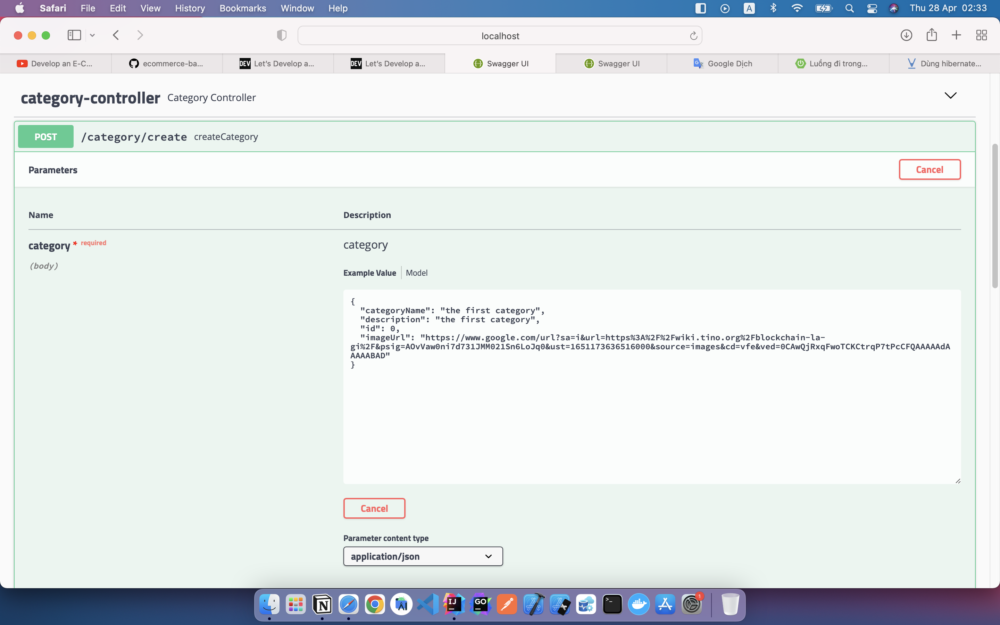
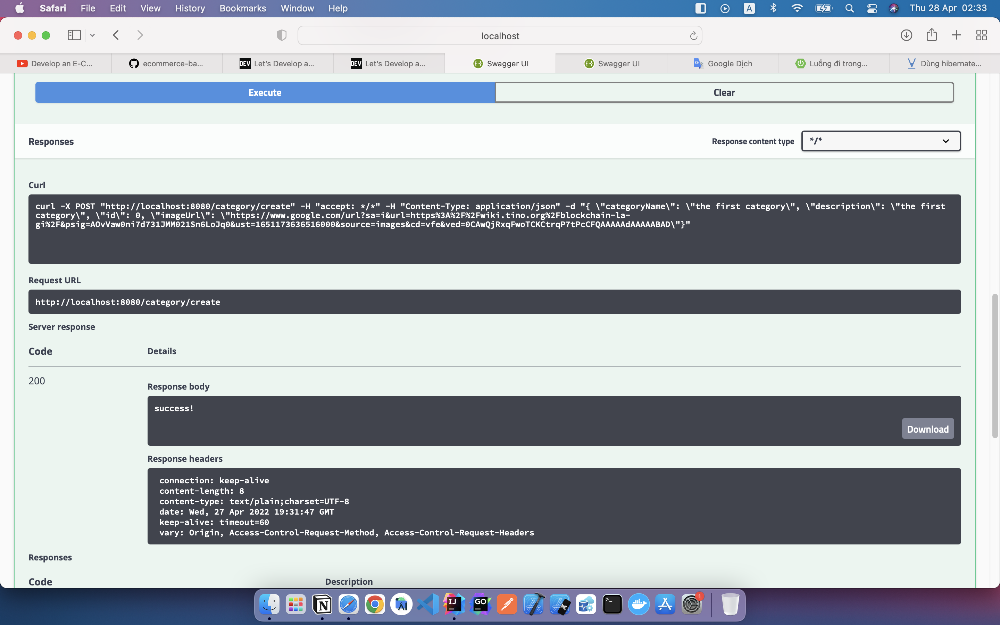
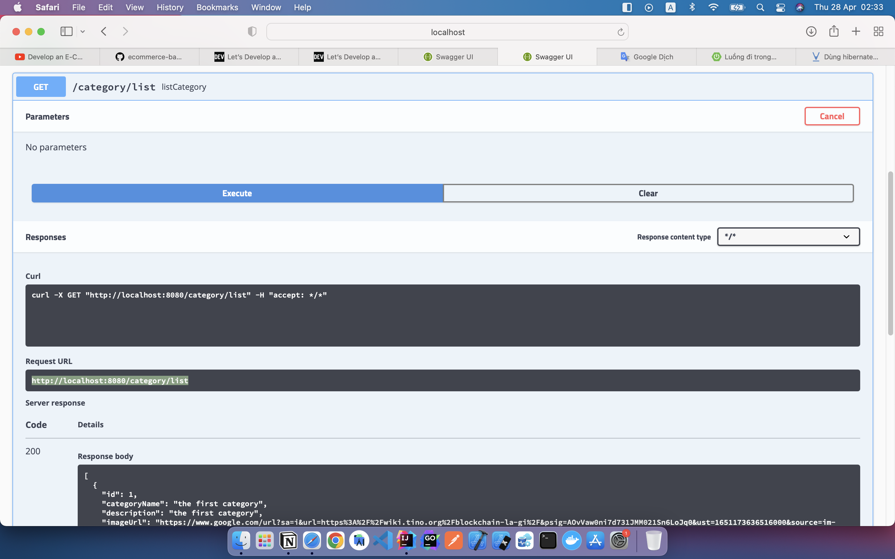
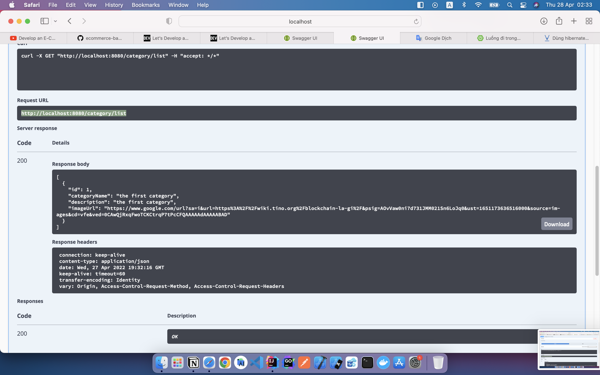

###TingTingECommerce use tech stack:
1. Backend : Springboot
   1. use Jpa
      1. test database: use com.h2database test data save in memory
         ```` 
         <dependency>
              <groupId>com.h2database</groupId>
              <artifactId>h2</artifactId>
              <scope>runtime</scope>
         </dependency> 
      
2. Fontend : Vuejs
3. Use Swagger create documment Api.
   1. https://viblo.asia/p/co-ban-ve-swagger-oOVlYjOV58W
    ````
        
    <dependency>
      <groupId>io.springfox</groupId>
      <artifactId>springfox-bean-validators</artifactId>
      <version>2.9.2</version>
    </dependency>

    <dependency>
      <groupId>io.springfox</groupId>
      <artifactId>springfox-swagger2</artifactId>
      <version>2.9.2</version>
    </dependency>

    <dependency>
      <groupId>io.springfox</groupId>
      <artifactId>springfox-swagger-ui</artifactId>
      <version>2.9.2</version>
    </dependency>
   ````
   ii.  We also have to modify our application.properties file by adding the lines
   1. ````
            spring.datasource.url=jdbc:h2:mem:testdb
            spring.datasource.driverClassName=org.h2.Driver
            spring.datasource.username=sa
            spring.datasource.password=password
            spring.jpa.database-platform=org.hibernate.dialect.H2Dialect  
       ````

   2. Test Api
      + Post : /category/create
        + 
        + 
      + Get  : /category/list
        + 
        + 